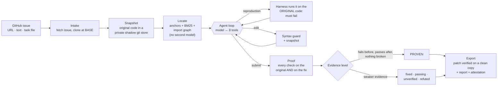
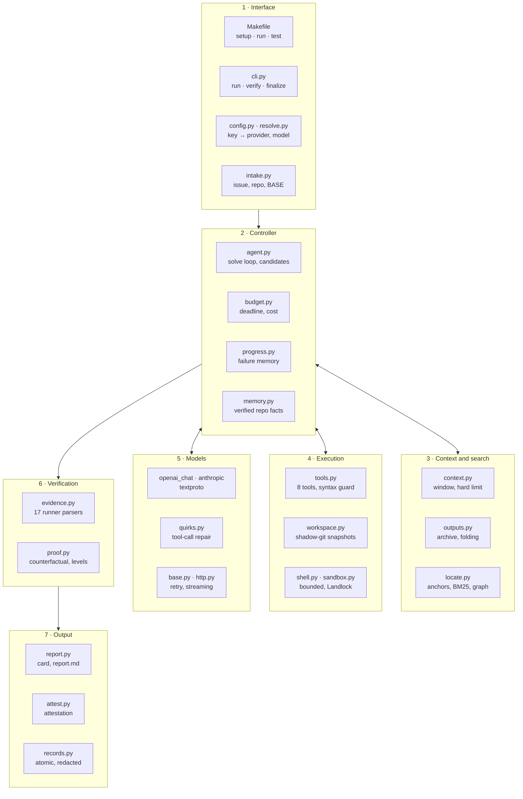

# Arbiter

**An autonomous coding agent that proves its fix before it hands it over — at a flat token cost.**


Give Arbiter a GitHub issue. It finds the buggy code, reproduces the bug, fixes it, and then does what
other agents skip: it runs the checks **on the original code and on the fix**. Only a change that turns
a failing check into a passing one, with nothing else broken, is marked **PROVEN**. You get a
byte-exact `patch.diff` plus the evidence — not just the model's word.

```text
━━ Result: calc-divide ━━
status        completed · termination model_submitted · submission_ready yes
verification  checks_passed — 2 check run(s) on the selected code (details in report.md)
proof         PROVEN — 2 qualified generated check(s) fail without the change and pass with it
  check                                                original  patched  result
  repro python -c "from calc.ops import divide; asser…     FAIL     pass  fail to pass
  python -m unittest discover -s tests                     FAIL     pass  fail to pass · fixes test_ops.OpsTest.test_divide_true_division
changes       2 files changed, 5 insertions(+), 1 deletion(-)
export        verified: patch applied to a clean base copy reproduces the selected tree exactly
usage         8 requests · 10115 tokens · 1.429 s
```
<sub>Real output of `make demo` (a scripted model, so it runs offline). A live run prints the same card.</sub>

---

## In one minute

**What is an AI harness?** A language model on its own only writes text. A *harness* is the software
around it that turns it into an agent: it gives the model tools (read, search, run, edit), decides what
the model sees at each step, keeps its work safe, and checks the result.

**The problem.** Today's coding agents
1. **trust the model blindly** — "bug fixed" is accepted without checking that the change fixed anything;
2. **burn tokens** — they resend the whole conversation every step, so cost grows with the *square* of the task length;
3. **are fragile** — a crash, a timeout or one bad late edit loses the work.

**Arbiter fixes all three:** proof instead of a claim, a flat token cost, and a fix that is never lost.

---

## Quick start

```bash
git clone https://github.com/sanath-2512/arbiter && cd arbiter
export AI_API_KEY="<your key>"
make setup      # checks Python ≥ 3.9 and git; nothing to install
make run        # paste a GitHub issue URL, owner/repo#N, @issue.md, or the issue text
make test       # 326 offline tests: no network, no key
```

Try it on a real bug from the more-itertools library (the code as it was before the maintainers' fix):

```bash
make run ISSUE=https://github.com/more-itertools/more-itertools/issues/1284 BASE=b2f3aff7633057d234ec9186c18a53f4df306d08
```

Everything can also be passed as arguments:

```bash
make run ISSUE=https://github.com/OWNER/REPO/issues/123          # clone the repo, fetch the issue, fix it
make run ISSUE="text of the issue" REPO=/path/to/repo            # a local checkout
make run TASK=tasks.jsonl                                        # a batch of tasks (SWE-bench style rows)
```

| Setting | Meaning |
|---|---|
| `AI_API_KEY` | The only credential. Its format selects the provider; it is never written to disk or logs. |
| `AI_MODEL`, `AI_BASE_URL` | Optional: pin a model or point at any OpenAI-compatible endpoint. The model is never substituted. |
| `BASE=` | Start from a given commit, or `before-issue` (the last commit before the issue was opened). |
| `TIME_LIMIT=`, `MAX_STEPS=` | Limits per task (defaults 1800 s and 150 steps). |

Requirements: Python 3.9+ and git on Linux or macOS. Standard library only; no packages.

---

## How efficient is it?

Every request to a model resends the conversation. A typical agent therefore pays for every earlier file
read and command output **again on every step**. Arbiter keeps the full record on disk and sends the
model only a reduced view — by fixed rules, with no model-written summaries.

```text
Input tokens over the same 40-step task
Typical agent (full history)   ████████████████████████████████████████  2.37M
Arbiter                        █████▎                                    0.31M   ← 7.6× fewer

Size of the 40th request
Typical agent (full history)   ████████████████████████████████████████  114.7k tokens
Arbiter                        ███                                         8.9k tokens   ← 13× smaller
```

| Measurement | Typical agent | Arbiter | Gain |
|---|---|---|---|
| Input tokens, 40-step task | 2.37M | **0.31M** | **7.6× fewer** |
| Size of the 40th request | 114.7k | **8.9k** | **13× smaller**, and it stays flat |
| A failing `cargo test`, as shown to the model | 2,899 chars | **688 chars** | **4.2× smaller** |
| Tool descriptions sent with every request | 4.6k chars | **3.8k chars** | −17% on every request |
| Requests spent just reading small relevant files | 1 per file | **0** | preloaded in the first prompt |
| Extra AI models to pay for (summariser, planner, judge) | common in other agents | **0** | all deterministic code |
| A small 9k-token context window | full history outgrows it within a few steps | **solved within it** | every request fits |

<sub>40-step session: each step writes a file and produces a 6,000-character output, measured with Arbiter's
context manager (`tests/test_context.py`). Folding and schema sizes: `tests/test_token_economy.py`.
Small window: `tests/test_provider_emulation.py`. A live 42-request run on a real repository averaged
about 3.7k tokens per request.</sub>

**How it gets there**

| Mechanism | What it does |
|---|---|
| **Observation window** | Only the **2 newest** tool outputs are sent in full. Older ones become one line — `[earlier tool output elided (6011 chars). read_output(id="o12") retrieves it.]` — and the full text stays on disk. |
| **Old arguments shrink** | A file the model wrote ten steps ago is not resent: argument keys stay, long strings become their size (`"[3000 chars elided]"`). |
| **Old reasoning shrinks** | Thinking models' reasoning is kept for the 2 newest turns; older reasoning becomes a 300-character stub, trimmed in steps so the provider's prompt cache stays valid. |
| **Noise folding** | Build progress, passing-test lines, standard-library stack frames and repeated warnings are folded; line numbers are kept so nothing becomes unreachable. |
| **Output cap** | Any one output is shown up to 6,000 characters (head and tail); the rest is archived and retrievable. |
| **Preloaded small files** | Small files the search pinpoints (up to 5,000 characters, whole files only) are in the first prompt. |
| **Lean tools** | 8 small tools with trimmed descriptions; `read_output` is offered only once an output has actually been shortened. |
| **Hard window guarantee** | Each request is estimated (calibrated against the provider's own token counts). Near the limit, reductions become sticky; if still too large, the newest outputs are trimmed head-and-tail; an overflow error lowers the limit and retries. The system prompt and the issue are never cut. |
| **No second model** | Finding the code, shrinking the context and verifying the fix are deterministic code. |
| **Loop breaker** | Failure memory notices when the model keeps failing the same way and forces a new approach, instead of burning tokens on the same idea. |

---

## How it solves an issue



1. **Intake** — accepts a GitHub issue URL, `owner/repo#N`, pasted text, `@issue.md` or a task file;
   clones the repository, optionally at the commit before the issue.
2. **Snapshot** — the original code goes into a private git store; every later step is snapshotted too.
3. **Locate** — file paths, stack-trace frames and identifiers in the issue are matched against the
   code and ranked with BM25 and the import/test graph (Python, JS/TS, Go, Rust).
4. **Agent loop** — the model reads, searches, runs and edits through 8 tools. The harness confirms its
   bug reproduction on the original code, refuses syntax-breaking edits, keeps every request small, and
   undoes git damage.
5. **Proof** — at submit, every check runs on the original code (with the new tests added) and on the fix;
   failing test names are compared across 17 test-runner formats.
6. **Export** — the version with the strongest evidence (not simply the last one) becomes `patch.diff`,
   verified by applying it to a clean copy, with `report.md`, `result.json` and a tamper-evident
   `attestation.json`.

| Evidence level | Meaning |
|---|---|
| **PROVEN** | Checks fail on the original code and pass with the change; no regressions |
| **fixed** | A known failing test (from the task) now passes; no regressions |
| **passing** | Checks pass, but they also passed before — no evidence the bug was addressed |
| **unverified** | No check could be run on the change |
| **refuted** | The change breaks a check that passed before |

---

## Architecture

About 10,000 lines of standard-library Python in `arbiter/`.



| Layer | Modules | Responsibility |
|---|---|---|
| Interface | `Makefile`, `cli.py`, `config.py`, `resolve.py`, `intake.py` | One command, one key; validated profile; issue and repository intake |
| Controller | `agent.py`, `budget.py`, `progress.py`, `memory.py`, `prompts.py`, `tasktype.py` | The solve loop, deadlines, loop breaking, safe cross-run learning |
| Context and search | `context.py`, `outputs.py`, `locate.py` | Token economy and finding the code without a second model |
| Execution | `tools.py`, `workspace.py`, `shell.py`, `sandbox.py`, `prewarm.py` | Safe tools, snapshots, bounded processes, credential isolation |
| Models | `models/openai_chat.py`, `anthropic.py`, `textproto.py`, `quirks.py`, `base.py`, `http.py` | Any OpenAI-compatible or Anthropic endpoint; repairs model quirks |
| Verification | `evidence.py`, `proof.py` | Counterfactual proof and evidence levels |
| Output | `report.py`, `attest.py`, `records.py` | Result card, report, attestation, redacted records |

---

## What makes it unique

**Proof, not promises**
- **Proof-carrying patches.** Every check runs on the original code and on the fix; only fail → pass with
  no regressions is PROVEN.
- **Confirmed reproductions.** The model's bug reproduction is run by the harness on the original code.
- **Evidence picks the winner.** The strongest-evidence version is delivered, so a bad late edit cannot
  replace a working fix.
- **Anyone can re-check.** `attestation.json` binds the patch to its proof with SHA-256 digests;
  `python3 -m arbiter verify --run-dir DIR` re-checks it offline (`--rerun` re-executes every check).
- **Cannot cheat.** Task tests are protected; syntax-breaking edits (Python, JSON, Rust, Go, JavaScript,
  Ruby) are refused.

**Minimal tokens** — 7.6× fewer input tokens on long tasks, a flat request size, every request inside the
window, no second model, and a loop breaker. Details in [How efficient is it?](#how-efficient-is-it)

**Never loses a fix** — every step is snapshotted; a crash, kill or timeout still exports the best verified
version, and `arbiter finalize` recovers an interrupted run without calling the model.

**Robust to real models** — tool calls written as plain text, malformed JSON and unfamiliar tool names are
recovered; long answers are streamed; rate limits and server errors are retried for up to 10 minutes within
the deadline; a provider's content-filter rejection withholds the likely trigger and retries.

**Learns safely** — working test and install commands carry over to the next run on the same repository;
only facts verified by execution, never code or patches.

**Safe to run** — one credential; on Linux the model's commands run in a Landlock sandbox that cannot read
it; commits, branch switches, stashes and even a deleted `.git` are undone; Rust projects are pre-built in
the background.

**Tested the way judges test — the Judge Rehearsal Lab** (`rehearsal/`)
- **22 real historical bugs** from Django, pytest, Flask, Click, ESLint, Express, Hugo, Sphinx, SymPy and
  Ansible, each pinned at the commit before the real fix and validated (**22/22**: hidden tests fail before,
  pass after).
- **Hidden tests stored encoded**, read only after the harness exits; every run is audited for references
  to them.
- **Ablation configs A–F** switch individual features off to measure what each contributes.
- **Stress cases**: decoy copies of the code, 15–20k noise files, multi-megabyte minified assets.
- **Localisation measured**: the right file is in Arbiter's first hints for **73%** of these tasks before
  the model reads anything.

---

## Results

| Evidence | Result |
|---|---|
| Deterministic test suite | **326 tests pass** (`make test`), including an attack catalogue, provider emulators and real Go/Rust/Node/Ruby toolchains |
| 46-task benchmark, offline | **46/46** judged by hidden tests (Rust, JavaScript, Python, Go, Ruby) on two provider emulators, 0 provider-rule violations. The model is scripted here, so this checks the pipeline, not model skill |
| Live, real repositories | **9/10** real-repository bugs and **8/8** owned tasks solved on free-tier models |
| Live, real GitHub bug | more-itertools **#1284** reproduced, fixed and exported; compare with the maintainers' commit `2b8d5cd` |
| Judge Rehearsal Lab | **22/22** real historical tasks validated |
| Fault injection | **0** invariant violations over 200 seeds with crashes, kills and provider errors (`make chaos`) |
| Clean-machine rehearsal | **9/9** official steps from a fresh clone with an empty environment (Python 3.9 and 3.13) |

---

## What you get

**In the terminal:** a live line for every step (tool call, result, harness checks on the original and on
the fix), then the result card and the patch.

**In `runs/<task>/<run>/`:**

| File | Contents |
|---|---|
| `patch.diff` | The fix, byte-exact and verified on a clean copy of the repository |
| `report.md` | Readable report: outcome, the proof table, the deliverable, every action taken |
| `result.json` | Machine-readable result: status, evidence level, tokens, timing, context statistics |
| `attestation.json` | Tamper-evident record binding the patch to its proof (SHA-256 digests) |
| `evidence.jsonl` | Every check with its outcome on the original code and on the fix |
| `transcript.jsonl`, `actions.jsonl`, `requests.jsonl` | Full conversation, every tool call, every model request with its token usage |

The repository's working tree is left at the fix, uncommitted, on its original base.

**Exit codes:** `0` done · `2` configuration or rejected key · `3` quota exhausted · `4` model endpoint
unreachable.

---

## Check it yourself

```bash
make test                                   # 326 offline tests, including attack and fault cases
make demo                                   # offline demo with a scripted model
make gauntlet-offline                       # 46 tasks judged by hidden tests, no key
make gauntlet                               # the same 46 tasks with your live model
make chaos                                  # fault injection: crashes, kills, provider errors
make check-config                           # validate the profile and the key without spending tokens
python3 scripts/eval.py --validate-suite    # every hidden test fails before the fix and passes after
```

## Layout

```
arbiter/      the harness (standard library only): agent loop, tools, context, proof, localisation,
              workspace, models
profiles/     model configuration (default.toml is used by make run)
tests/        326 offline tests
scripts/      setup, evaluation, task generator, provider emulators, fault injection
evalsuite/    48 tasks with hidden tests that the harness never reads
rehearsal/    Judge Rehearsal Lab: 22 real historical bugs, ablation configs, results
```

## Licence and provenance

`arbiter/shell.py` adapts the process-group timeout pattern of mini-swe-agent (MIT).
`arbiter/_vendor/tomli` is tomli 2.2.1, verbatim (MIT). Design notes and every measurement: [NOTES.md](NOTES.md).
